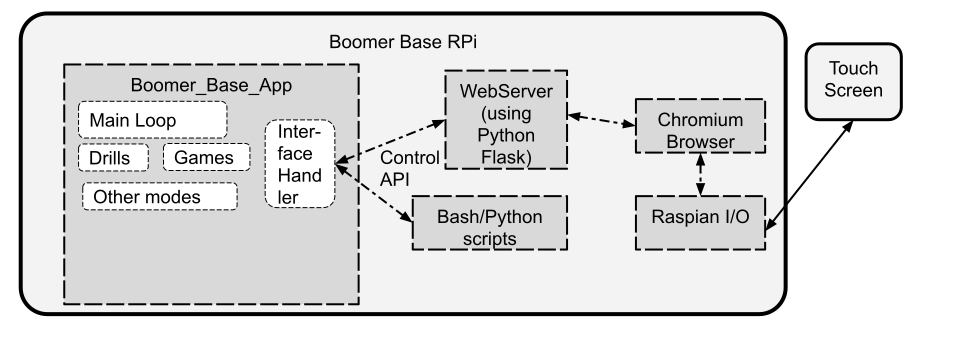

# Overview


The User Interface uses a touchscreen interfaced by Raspian/Linux drivers (the screen uses HDMI, the touch function uses USB).

The components in the diagram are:
* Boomer base: controls the ball throwing motors and performs ball tracking.  A real-time program written in C
* Web server: serves HTML pages including javascript and css files.  It uses [Flask](https://en.wikipedia.org/wiki/Flask_\(web_framework\)) to serve the pages.  The framework and pages served is written in Python.  The web-server also uses [Flask-SocketIO](https://flask-socketio.readthedocs.io/en/latest/) to send scoring updates to the browser and receive events, like level changes, from the browser.
* The Chromium browser that comes pre-installed with Raspbian.  It is launched on startup and configured to run full-screen so that browser controls (address bar, back button, refresh) are not visible.
   * Refer to after_boot.sh in the boomer_supporting_files for how Chromium is launched on startup

A mouse and keyboard will not be available - the only input will be the touchscreen.  This is significant for the following reasons:
* numeric entry is not simple - a touchscreen style keypad would have to be implemented.  Hence numeric controls (like tennis skill level) should use +/- buttons instead of number input
* browser features like hover (tool tips) and focus are not available

# Installation Instructions

For development using VS Code, install the Microsoft Python Extension in order to run under VScode control.

git clone https://github.com/davidcjordan/ui-webserver presumably to a ~/repos directory.

https://github.com/davidcjordan/control_ipc_utils should be cloned to ~/repos.  The scripts in this repository use scripts and defines in the control_ipc_utils to send messages to the base in order to set/get information.  

A virtual environment (venv) is used to install gunicorn and flask.  The after_boot.sh script (in the boomer_supporting_files repo) creates and installs the correct versions.

jquery.js is already installed on Raspbian, but a symbolic link needs to be made.  Run the following script which is the app directory.
```
./make_links.sh
```

For more info:  https://flask-socketio.readthedocs.io/en/latest/intro.html

The socket.io client needs to be installed in order to run not connected to the net.
For development, I used:
`<script src="https://cdnjs.cloudflare.com/ajax/libs/socket.io/4.0.1/socket.io.js" integrity="sha512-q/dWJ3kcmjBLU4Qc47E4A9kTB4m3wuTY7vkFJDTZKjTs8jhyGQnaUrxa0Ytd0ssMZhbNua9hE+E7Qv1j+DyZwA==" crossorigin="anonymous"></script>
`

Couldn't get the following to work, so instead installed socket.io client using npm and copied to repository
   `<script src="/socket.io/socket.io.js"></script>`
So now it's:
   `<script src="/static/js/socket.io.js"></script>`
 
The client is already in this repo; the following is just for reference on how the client was installed:
```
sudo apt update
sudo apt install nodejs npm
cd ~/repos/ui-webserver/app/static/js
cp /home/pi/node_modules/socket.io-client/dist/socket.io.js .
cp /home/pi/node_modules/socket.io-client/dist/socket.io.js.map .
```

# Other dependencies:

git clone https://github.com/davidcjordan/drills to ~/boomer should have already been performed. The file *ui_drill_selection_lists.py* in the drills directory is used by the UI to present a subset of drills to select.

# Implementation notes:

## starting, stopping and visibility

The UI web server is started by systemd when the system boots.  Refer to boomer_supporting_files/base_gui.service

The Chromium browser is launched full screen on the desktop with a home page is http://localhost:1111.  This so the UI appears on the touchscreen.  However, the webpage can be reached by remote browsers by setting the address to base_ip:1111 where the base_id can either be an address on your local network or a tailscale address.  This allows coding and debugging all from 1 computer without having to physically interact with the touchscreen (the touchscreen should be used for final testing).  Browsers have a 'developer mode' that allows setting the window size to 1280x800, using the javascript console, and reviewing the page elements.

There are 2 aliases for stopping and starting the ui: uistop & uistart, defined in boomer_supporting_files.  uistop takes a multiple seconds if a browser is connected to the ui-webserver. To make uistop fast, then do 'pkill -o Chromium' for the touchscreen browser, and if using a remote browser, go to a different webpage, e.g. example.com.

The UI logs to /run/shm/ui.log

The UI needs to be restarted in order to see python or html (template) changes.  It does not have to be restarted for javascript modifications.  Not sure about CSS changes.

### (OLD, for reference) Starting the web server using gunicorn:
Use the following to start it from shell:
```
gunicorn  --config gunicorn.conf.py --log-config gunicorn_log.conf "app:create_app()"
```
Use the following to start it using systemd: ~/.config/systemd/user/base_gui.service
```
ExecStart=/bin/bash -c 'PATH=/home/pi/repos/ui-webserver/venv/bin:$PATH exec gunicorn --config gunicorn.conf.py --log-config gunicorn_log.conf "app:create_app()"'
```

## Templates
The base template has a section for page specific javascripts & css, as well as js required on all pages (socketio and state_update).  The base template is inherited on all other pages/templates.

## Flow
###
* Main (POST)-> drill_select_type (POST with form)-> select (POST on start button) -> drill
* Main (POST-with-mode=workout)-> select
* Main (POST)-> game_options

## New way of Drill selection
There are 4 pages:
* Recents: a persisted list of 10 or so drills the user has used recently.  Persisted in this_boomers_data/recents.json  Pre-populated with drills commonly used when Boomer is first installed.
* Select: uses radio buttons to select between line drills and drill categories (practice objective, stroke type, level)
* Beep: has radio buttons to determine which drill to use
* Custom: select DRL4xx.csv to edit where the drill CSV files are stored in this_boomers_data

### Displaying drill information
A 'div' will be created at the top of the drill selection page (uses the choice_inputs template).  The div will be populated by javascript when the user clicks on a drill.  On click, the page will use socketio to emit a 'drill_info' request and get a response with a drill description generated by the python web server.  The server will read the drill file to generate the description, using description part of the drill and analyzing the drill file (number of balls, duration, whether level controls are available, e.g. all custom balls).

## Old way of Drill selection 
Refer to [Drill Categorization and Filtering](https://docs.google.com/document/d/1V0n3HToN0-XzfUT8dVTWYwKsZZYaLfdsvD9uuKcMHIQ)

### Lists of Drills/Workouts 
Without filtering a drill list is as follows:
```
drill_list_test = [\
   {'id': '100', 'name': 'Test 100'},\
   {'id': '800', 'name': 'Test servoing'},\
...]
```

### Filters
Filters are used to reduce the number of buttons (drills or workflows) the user can select from - to shrink the list of drills from an overwhelming number.

To use filters on the select.html page, a filter list needs to be provided, e.g.
```
drill_filter_list = ['data-Type', 'data-Stroke', 'data-Difficulty']
```
The 'data-' prefix is used by the filtrify javascript to filter the items.  So the example filters are Type, Stroke and Difficulty.

Additionally, each drill in the drill list needs to have a  key 'filter_values' containing a list of values to assign for each filter, e.g.:
```
{'id': '005', 'name': 'Groundstrokes Random 20 balls', 'filter_values': ['Development', 'Ground', 'Medium']}

```
When a filter_list is provided, and the drill_list includes filter_values, the select.html buttons will have extra attribute for each filter, e.g. 
```
data-Type="Development"
```

## Drill Editor
Since the touchpad keyboard is not easy to use, the drill titles are 'Custom Drill N', where you can have up to 10 custom drills.

If there are no DRL4*.csv files in the this_boomers_data directory, then DRL401.csv is created by copying DRL900.csv from the drills repo to DRL401.csv in order to have one custom drill to start with.  More custom drills can be created by clicking the 'duplicate' icon.

Since the ROTTYPE enum was so long, I separated it into 2 fields: "Court" and "Angle" in order to make the drop-down menu shorter.

There are icons for adding a row and deleting the last row.  Currently there is no dialog asking which row to delete.

The numeric inputs, like Delay, are drop-down instead of number picker.  This was easier to implement and more consistent with the editing view. I selected the delays available figuring nobody will notice a granularity of 100 milliseconds in the delay field.

The Comment column in custom drills currently cannot be populated.  If this was implemented, then a short list of sound files would be used.

The edit_drill.js has scripts for handling a click of row add and delete.  It also handles when the shot_type changes to or from CUSTOM: when CUSTOM is selected, defaults are filled in for speed, loft and spin.  When other shot types are selected, then speed, loft and spin are populated with '------' in order to show they are not relevant.  6 dashes are used in order to keep the pull-down selector wide enough that it can be scrolled - although scrolling using touchscreen is a bit awkward.

## Workout Editor
Workouts are a csv with 3 columns: Drill number, Minutes to run the drill and a comment played before starting the drill.

Since a pulldown with a lot of entries is a bit awkward, I would recommend the pulldown be limited to 20 or so drills.  IMO, the drill name/title should be in the pull-down, not the drill number.  Probably the Custom Drills should take up the first selection entries.

The workout editor would be modeled after the Drill editor:
- A 'Custom' button would be added to the workout row on the home screen.
- EDIT_WORKOUT_URL, EDIT_WORKOUT_DONE_URL, COPY_WORKOUT_URL would be added to defines.py
- a new template 'workout_show' would be generated, or the current 'drill_show' would be modified to support both drills and workouts
- CUSTOM_SELECTION_URL would need to be changed to CUSTOM_DRILL_SELECTION_URL and a CUSTOM_WORKOUT_SELECTION_URL added
- edit_workout() function needs to be added.


## Disabling the context pop-up in kiosk mode
refer to https://stackoverflow.com/questions/28222548/how-to-disable-context-menu-on-right-click-long-touch-in-a-kiosk-mode-of-chrome
```
  <script type="text/javascript">
    // disable the context memu that occurs if the screen is touched too long
    window.addEventListener("contextmenu", function(e) { e.preventDefault(); })
  </script>
```
# Locating Court Points web-page notes:

* the PNG of the right or left camera is shown in 1/4 size: 640x400
* a 64x64 pixel square shows the area that is zoomed
 * currently at 8x 


## Selecting a pixel
When the up/down buttons are pushed, the background.top is reduced or increased by 1 pixel.
Same for the left/right buttons: background.left is reduced or increased.
A cursor used to identify the selected pixels is in the center of the zoomedDiv.
So only the background.top/left need to be maintained; the cursor/selected pixels is constant relative to the top/left.
(The lens needs to be moved also... TBD)

## templates
The base template has a section for page specific javascript.  This is used on the following pages:
* select.html: whether to enable filtrify (or not); NOT include
* game and drill.html: enable pause_resume, number-picker
* choice_inputs: enable emits per radio button
